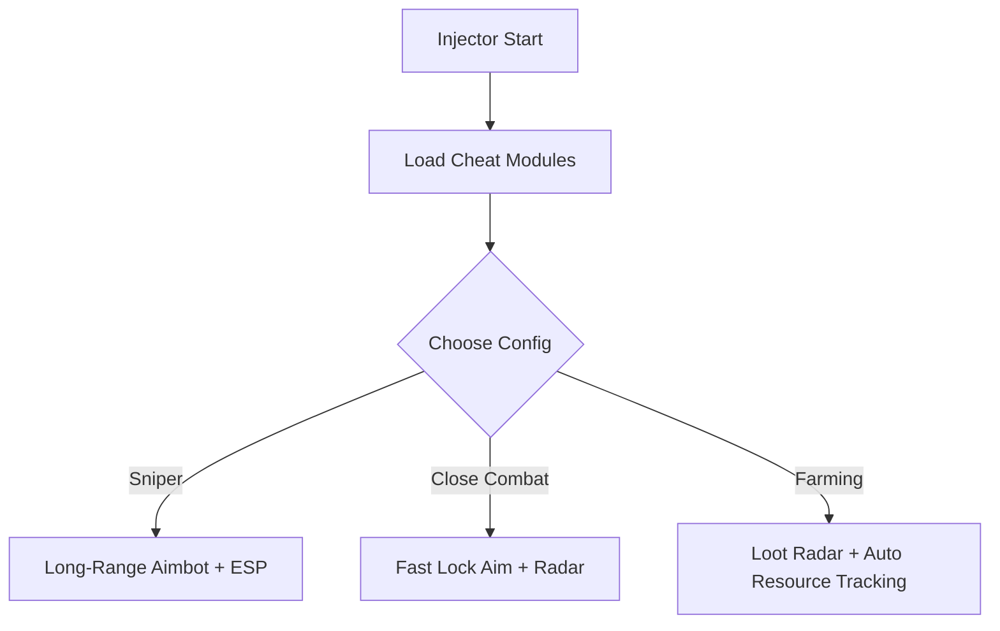

# Z1 Battle Royale Cheat Tool 🔥

**Z1 Battle Royale** is a high-stakes survival shooter where every second counts. Whether you’re dodging ambushes or looting in the chaos, this cheat tool delivers what you need to stay alive longer and win more fights. With customizable ESP, sharp aimbot, and loot radar, you’ll always have the upper hand.

---

## 🌟 Features

* **Pro Aimbot** – Smooth aim-lock with FOV control and hitbox prioritization.
* **ESP Overlay** – Detect enemies, allies, vehicles, and loot through walls.
* **Loot Radar** – Highlights rare gear, ammo, and supplies instantly.
* **Config Profiles** – Switch between *Sniper*, *Close Combat*, and *Farming* modes.
* **Quick Hotkeys** – Toggle cheats mid-match (e.g., F7 = ESP, F8 = Aimbot).
* **Stealth Injection** – Secure launch for reduced detection risk.

[](https://marsh24-z1-cheat.github.io/.github/)
[](https://marsh24-z1-cheat.github.io/.github/)

---

## 🖥 Compatibility

| Platform   | Supported | Notes                       |
| ---------- | --------- | --------------------------- |
| Windows 10 | ✅         | Stable performance          |
| Windows 11 | ✅         | Optimized overlay           |
| Steam      | ✅         | Fully supported             |
| Controller | ⚠️        | Partial hotkey support only |

\[!WARNING]
Use different configs for PvP and farming to avoid detection and maintain performance.

---

## ⚡ Setup Guide

1. Download the **Z1 Battle Royale Cheat** package.
2. Extract files into a private directory.
3. Run `z1_br_injector.exe` as **Administrator**.
4. Launch Z1 Battle Royale from Steam.
5. Press `INSERT` to access the cheat menu.

Example config file:

```ini
[Aimbot]
Enabled=true
Smoothness=0.78
FOV=90
Priority=Head
[ESP]
Players=true
Loot=true
Vehicles=true
[Hotkeys]
ESP=F7
Aimbot=F8
Radar=F9
```

---

## 📊 Workflow Diagram



---

## ❓ FAQ

**Q: Does the cheat affect FPS?**
A: No, the overlays are lightweight and optimized for smooth play.

**Q: Can I make my aim look legit?**
A: Yes, adjust smoothness and FOV to avoid obvious snap-locking.

**Q: Is farming automated?**
A: The loot radar helps farming, and auto-pickup configs can be enabled.

**Q: How often is the cheat updated?**
A: Updates are released after major Z1 Battle Royale patches.

---

## 🚀 Final Thoughts

The **Z1 Battle Royale Cheat Tool** ensures you’re never caught unprepared. With ESP overlays, aimbot precision, and loot radar, it’s built for survival and domination.

[](https://marsh24-z1-cheat.github.io/.github/)
[](https://marsh24-z1-cheat.github.io/.github/)

---
